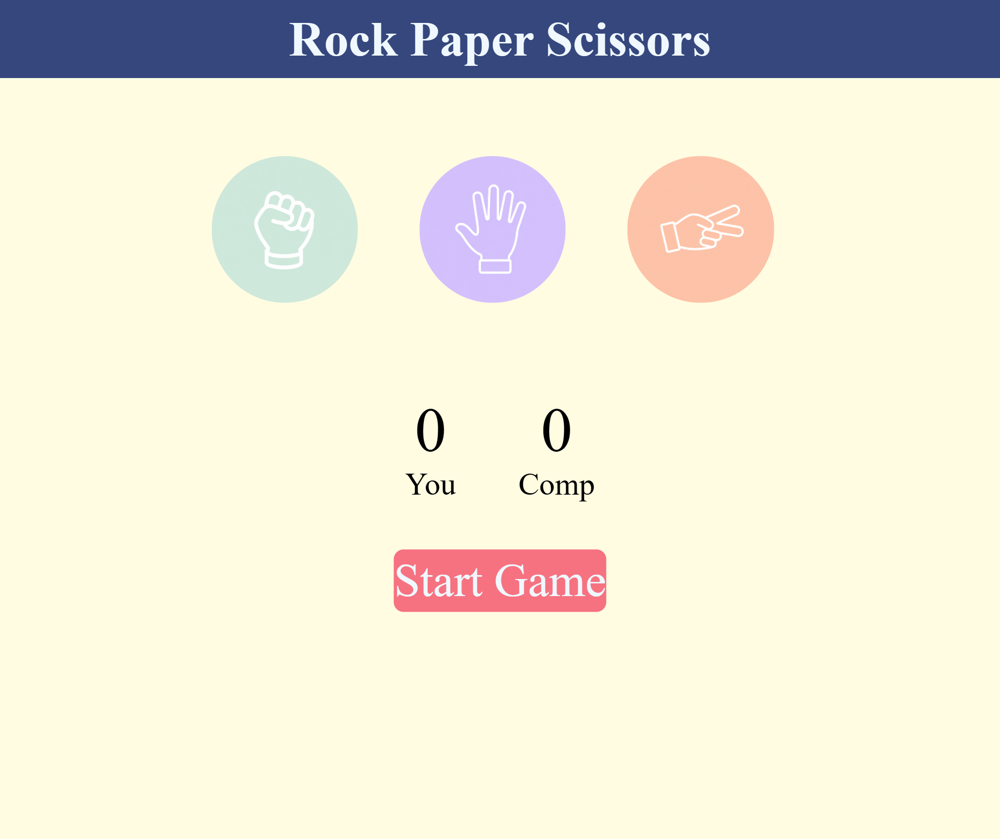

# ✊✋✌️ Rock Paper Scissors Game

A responsive **Rock Paper Scissors** game built using **HTML, CSS, and JavaScript**. Challenge the computer, keep track of the score, and enjoy a clean pastel-themed interface with smooth hover effects and dynamic game messages.

---

## 📸 Preview

> Add a screenshot of your project here after uploading it.

Example:



---

## 🚀 Features

- 🎮 Interactive Rock, Paper, Scissors gameplay
- 🤖 Random computer move generation
- 📊 Live score tracking for both player and computer
- 🎨 Beautiful pastel-themed UI
- ✨ Smooth hover animations on game icons
- 📱 Fully responsive design for desktop, tablet, and mobile
- 🟢 Dynamic message box with different colors for:
  - Win
  - Lose
  - Draw

---

## 🛠️ Technologies Used

- HTML5
- CSS3
- JavaScript (Vanilla JS)

---

## 📂 Project Structure

```
Rock-Paper-Scissors/
│
├── index.html
├── style.css
├── app.js
├── images/
│   ├── rock.png
│   ├── paper.png
│   └── scissors.png
└── README.md
```

---

## 🎯 How to Play

1. Click on **Rock**, **Paper**, or **Scissors**.
2. The computer randomly selects its move.
3. The winner is decided using the standard game rules:
   - 🪨 Rock beats Scissors
   - 📄 Paper beats Rock
   - ✂️ Scissors beats Paper
4. Scores are updated automatically.
5. Continue playing as many rounds as you like!

---

## 🎨 UI Highlights

- Pastel color theme
- Circular game icons
- Hover animation with lift effect
- Responsive layout for different screen sizes
- Color-changing result message
  - 🟢 Green → Win
  - 🔴 Red → Lose
  - 🔵 Blue → Draw

---

## 📱 Responsive Design

The game is optimized for:

- 💻 Desktop
- 📱 Mobile
- 📟 Tablet

Media queries ensure a smooth experience across different screen sizes.

---

## 📷 Screenshots

### Home Screen

_Add your screenshot here_

```
images/screenshot.png
```

---

## 💡 Future Improvements

- 🔊 Add sound effects
- 🎵 Background music toggle
- 🏆 Winning score limit
- 🔄 Reset Game button
- 🌙 Dark mode
- 📜 Game history
- 🎭 Multiplayer mode

---

## ▶️ Getting Started

Clone the repository:

```bash
git clone https://github.com/your-username/rock-paper-scissors.git
```

Navigate to the project folder:

```bash
cd rock-paper-scissors
```

Open `index.html` in your browser.

---

## 👩‍💻 Author

**Sanskruti Shelar**

GitHub: https://github.com/your-username

---

## 📄 License

This project is open source and available under the **MIT License**.
